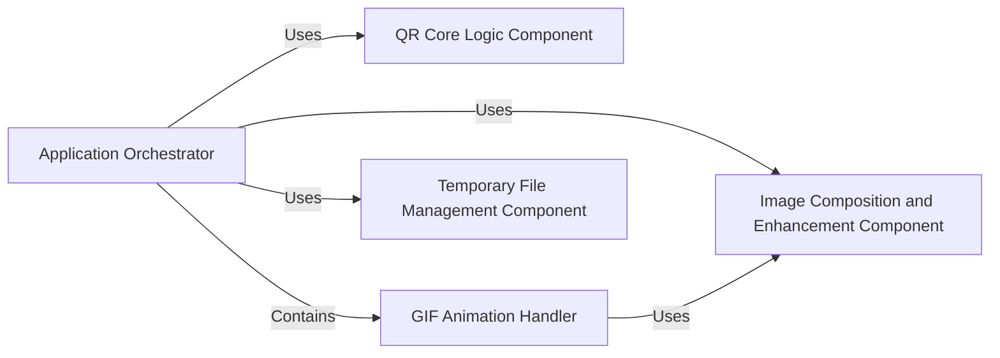

## Component Details

One paragraph explaining the functionality which is represented by this graph. What the main flow is and what is its purpose.

### Application Orchestrator

This is the central control hub of the amazing-qr application. It performs comprehensive parameter validation for all inputs and orchestrates the high-level flow of QR code generation. It determines the appropriate processing path based on whether a picture is provided (static, GIF, or none) and delegates specific tasks to other components or internal functionalities.

**Related Classes/Methods**:

- <a href="https://github.com/x-hw/amazing-qr/blob/master/amzqr/amzqr.py#L21-L131" target="_blank" rel="noopener noreferrer">`amzqr.amzqr:run` (21:131)</a>

- <a href="https://github.com/x-hw/amazing-qr/blob/master/amzqr/amzqr.py#L21-L131" target="_blank" rel="noopener noreferrer">`amzqr.amzqr:run` (21:131)</a>

- <a href="https://github.com/x-hw/amazing-qr/blob/master/amzqr/amzqr.py#L21-L131" target="_blank" rel="noopener noreferrer">`amzqr.amzqr:run` (21:131)</a>

- <a href="https://github.com/x-hw/amazing-qr/blob/master/amzqr/amzqr.py#L21-L131" target="_blank" rel="noopener noreferrer">`amzqr.amzqr:run` (21:131)</a>

### QR Core Logic Component

This component encapsulates the primary logic for generating the raw QR code matrix. It is responsible for the mathematical and structural aspects of QR code creation, including data encoding, error correction, and matrix construction, before any visual rendering or image composition takes place.

**Related Classes/Methods**:

- <a href="https://github.com/x-hw/amazing-qr/blob/master/amzqr/mylibs/theqrmodule.py#L7-L21" target="_blank" rel="noopener noreferrer">`amzqr.mylibs.theqrmodule:get_qrcode` (7:21)</a>

### Image Composition and Enhancement Component

This component is responsible for visually integrating the generated QR code with a background image. It handles image loading, resizing, applying visual enhancements (contrast, brightness), and precisely overlaying the QR code modules onto the background, accounting for transparent pixels and alignment patterns. This component is implemented as a nested function within the Application Orchestrator but serves a distinct, reusable purpose for image manipulation.

**Related Classes/Methods**:

- <a href="https://github.com/x-hw/amazing-qr/blob/master/amzqr/amzqr.py#L51-L86" target="_blank" rel="noopener noreferrer">`amzqr.amzqr:combine` (51:86)</a>

### GIF Animation Handler

This specialized component, implemented as a distinct block of logic within the Application Orchestrator's run method, manages the processing of animated GIF background images. It extracts individual frames from a GIF, coordinates the composition of each frame with the QR code using the Image Composition and Enhancement Component, and then reassembles the processed frames into a new animated GIF output.

**Related Classes/Methods**:

- <a href="https://github.com/x-hw/amazing-qr/blob/master/amzqr/amzqr.py#L21-L131" target="_blank" rel="noopener noreferrer">`amzqr.amzqr:run` (21:131)</a>

### Temporary File Management Component

This component is responsible for the creation, management, and eventual cleanup of temporary directories and intermediate image files generated during the QR code and image composition process. It ensures that the application leaves no residual files after execution.

**Related Classes/Methods**:

- <a href="https://github.com/x-hw/amazing-qr/blob/master/amzqr/amzqr.py#L21-L131" target="_blank" rel="noopener noreferrer">`amzqr.amzqr:run` (21:131)</a>

- <a href="https://github.com/x-hw/amazing-qr/blob/master/amzqr/amzqr.py#L21-L131" target="_blank" rel="noopener noreferrer">`amzqr.amzqr:run` (21:131)</a>

### [FAQ](https://github.com/CodeBoarding/GeneratedOnBoardings/tree/main?tab=readme-ov-file#faq)