```mermaid

graph LR

    QR_Code_Core_Engine["QR Code Core Engine"]

    Data_Encoding_Component["Data Encoding Component"]

    Error_Correction_Component["Error Correction Component"]

    Structure_Component["Structure Component"]

    Matrix_Construction_Component["Matrix Construction Component"]

    Drawing_Component["Drawing Component"]

    QR_Code_Core_Engine -- "orchestrates" --> Data_Encoding_Component

    QR_Code_Core_Engine -- "orchestrates" --> Error_Correction_Component

    QR_Code_Core_Engine -- "orchestrates" --> Structure_Component

    QR_Code_Core_Engine -- "orchestrates" --> Matrix_Construction_Component

    QR_Code_Core_Engine -- "orchestrates" --> Drawing_Component

    Data_Encoding_Component -- "outputs encoded data to" --> Error_Correction_Component

    Data_Encoding_Component -- "provides data codewords to" --> Structure_Component

    Error_Correction_Component -- "outputs ECC codewords to" --> Structure_Component

    Structure_Component -- "receives data codewords from" --> Data_Encoding_Component

    Structure_Component -- "receives ECC codewords from" --> Error_Correction_Component

    Structure_Component -- "outputs final bitstream to" --> Matrix_Construction_Component

    Matrix_Construction_Component -- "receives final bitstream from" --> Structure_Component

    Matrix_Construction_Component -- "outputs QR matrix to" --> Drawing_Component

    Drawing_Component -- "receives QR matrix from" --> Matrix_Construction_Component

    click QR_Code_Core_Engine href "https://github.com/x-hw/amazing-qr/blob/main/.codeboarding//QR_Code_Core_Engine.md" "Details"

```

## Component Details

This subsystem is the intellectual core of the QR code generation process, orchestrating the sequential, low-level steps required to transform raw input data into a structured QR code matrix. It acts as a pipeline manager, coordinating data encoding, error correction, bitstream structuring, matrix construction, and final image rendering by delegating to specialized data processing modules.

### QR Code Core Engine

This component serves as the central orchestrator for the entire QR code generation process. It manages the sequential flow, delegating specific tasks like data encoding, error correction, bitstream structuring, and final matrix construction to specialized sub-components. Its primary role is to coordinate these low-level operations to transform raw input data into a complete QR code matrix.

**Related Classes/Methods**:

- <a href="https://github.com/x-hw/amazing-qr/blob/master/amzqr/mylibs/theqrmodule.py#L1-L1" target="_blank" rel="noopener noreferrer">`theqrmodule.py` (1:1)</a>

### Data Encoding Component

This component is responsible for the initial conversion of input data into a bit string format suitable for QR code generation. It intelligently selects the most appropriate encoding mode (e.g., numeric, alphanumeric, byte, Kanji) and appends necessary control information such as character count indicators (CCI) and terminators.

**Related Classes/Methods**:

- <a href="https://github.com/x-hw/amazing-qr/blob/master/amzqr/mylibs/data.py#L1-L1" target="_blank" rel="noopener noreferrer">`data.py` (1:1)</a>

### Error Correction Component

This component focuses on generating error correction codewords. It takes the encoded data and applies Reed-Solomon error correction algorithms to produce redundant data. This redundancy is crucial for the QR code's robustness, allowing it to be scanned even if partially damaged or obscured.

**Related Classes/Methods**:

- <a href="https://github.com/x-hw/amazing-qr/blob/master/amzqr/mylibs/ECC.py#L1-L1" target="_blank" rel="noopener noreferrer">`ECC.py` (1:1)</a>

### Structure Component

This component is responsible for organizing and interleaving the data codewords and error correction codewords into a final, structured bitstream. This bitstream is then ready to be placed onto the QR code matrix according to the QR code standard.

**Related Classes/Methods**:

- <a href="https://github.com/x-hw/amazing-qr/blob/master/amzqr/mylibs/structure.py#L1-L1" target="_blank" rel="noopener noreferrer">`structure.py` (1:1)</a>

### Matrix Construction Component

This component is responsible for the physical construction of the QR code matrix. It integrates various functional patterns (e.g., finder patterns, separator patterns, alignment patterns, timing patterns, dark module, reserving areas) and precisely places the interleaved data and error correction bits onto the grid. It also applies masking patterns to optimize the QR code's readability and scanning performance.

**Related Classes/Methods**:

- <a href="https://github.com/x-hw/amazing-qr/blob/master/amzqr/mylibs/matrix.py#L1-L1" target="_blank" rel="noopener noreferrer">`matrix.py` (1:1)</a>

### Drawing Component

This component takes the constructed QR code matrix and renders it into a visual image file (e.g., PNG). It handles the actual pixel-level drawing and saving of the QR code.

**Related Classes/Methods**:

- <a href="https://github.com/x-hw/amazing-qr/blob/master/amzqr/mylibs/draw.py#L1-L1" target="_blank" rel="noopener noreferrer">`draw.py` (1:1)</a>

### [FAQ](https://github.com/CodeBoarding/GeneratedOnBoardings/tree/main?tab=readme-ov-file#faq)