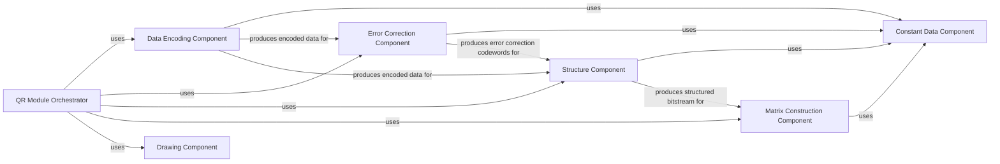

## Component Details

This section details the core components responsible for the intricate process of QR code generation, from initial data encoding to final matrix construction. These components are fundamental to adhering to the QR standard and ensuring the readability and error-correction capabilities of the generated QR codes.

### Data Encoding Component

This component is responsible for the initial transformation of input data (e.g., text, numbers) into a binary bitstream according to the QR code standard's encoding modes (numeric, alphanumeric, byte, Kanji). It handles character set conversion, applies character count indicators (CCI), and adds terminators as required. It also groups the data codewords into blocks based on the QR version and error correction level.

**Related Classes/Methods**:

- <a href="https://github.com/x-hw/amazing-qr/blob/master/amzqr/mylibs/data.py#L5-L44" target="_blank" rel="noopener noreferrer">`amzqr.mylibs.data.encode` (5:44)</a>

### Error Correction Component

This component generates error correction codewords using Reed-Solomon error correction algorithms. These codewords are crucial for the QR code's ability to be scanned even if partially damaged or obscured. It calculates the necessary redundancy based on the chosen error correction level and the data codewords provided by the Data Encoding Component.

**Related Classes/Methods**:

- <a href="https://github.com/x-hw/amazing-qr/blob/master/amzqr/mylibs/ECC.py#L5-L10" target="_blank" rel="noopener noreferrer">`amzqr.mylibs.ECC.encode` (5:10)</a>

### Structure Component

This component takes the encoded data codewords and the generated error correction codewords, interleaves them, and arranges them into the final bitstream. It also incorporates format information, version information, and any required remainder bits, preparing the data for placement onto the QR matrix.

**Related Classes/Methods**:

- <a href="https://github.com/x-hw/amazing-qr/blob/master/amzqr/mylibs/structure.py#L4-L10" target="_blank" rel="noopener noreferrer">`amzqr.mylibs.structure.structure_final_bits` (4:10)</a>

### Matrix Construction Component

This component is responsible for building the two-dimensional QR code matrix. It places all functional patterns (finder, separator, alignment, timing, dark module, reserving areas) and then strategically positions the structured data and error correction bits onto the matrix. Finally, it applies a masking pattern to optimize the QR code's readability and balance dark/light modules, and adds format and version information strings.

**Related Classes/Methods**:

- <a href="https://github.com/x-hw/amazing-qr/blob/master/amzqr/mylibs/matrix.py#L4-L32" target="_blank" rel="noopener noreferrer">`amzqr.mylibs.matrix.get_qrmatrix` (4:32)</a>

### Constant Data Component

This foundational component serves as a central repository for all static data, lookup tables, and predefined patterns essential for QR code generation. This includes character capacities, encoding mode indicators, Reed-Solomon generator polynomials, error correction codeword counts, powers of 2 lists, log lists, error correction level indices, required remainder bits, grouping lists for data codewords, alignment pattern locations, format information strings, and version information strings.

**Related Classes/Methods**:

- <a href="https://github.com/x-hw/amazing-qr/blob/master/amzqr/mylibs/constant.py#L1-L1" target="_blank" rel="noopener noreferrer">`amzqr.mylibs.constant` (1:1)</a>

### QR Module Orchestrator

This component acts as the high-level coordinator for the entire QR code generation process. It orchestrates the sequence of operations by calling the Data Encoding, Error Correction, Structure, and Matrix Construction components in the correct order to transform raw input into a final QR matrix. It also initiates the drawing process for the final QR code image.

**Related Classes/Methods**:

- <a href="https://github.com/x-hw/amazing-qr/blob/master/amzqr/mylibs/theqrmodule.py#L7-L21" target="_blank" rel="noopener noreferrer">`amzqr.mylibs.theqrmodule.get_qrcode` (7:21)</a>

### Drawing Component

This component is responsible for rendering the final QR code image.

**Related Classes/Methods**: _None_

### [FAQ](https://github.com/CodeBoarding/GeneratedOnBoardings/tree/main?tab=readme-ov-file#faq)