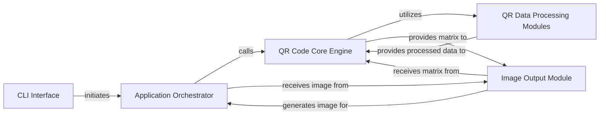

## Component Details

Final Architecture Analysis for `amazing-qr`. Based on the Control Flow Graph (CFG) and Source Analysis, the `amazing-qr` project can be effectively understood through five fundamental components. These components represent distinct responsibilities within the application's lifecycle, from user interaction to the final image output.

### CLI Interface

This component serves as the primary entry point for user interaction. It is solely responsible for parsing command-line arguments provided by the user and performing initial, basic validation of these inputs. Once processed, it initiates the main application flow by passing the validated arguments to the Application Orchestrator.

**Related Classes/Methods**:

- <a href="https://github.com/x-hw/amazing-qr/blob/master/amzqr/terminal.py#L6-L37" target="_blank" rel="noopener noreferrer">`amzqr.terminal.main` (6:37)</a>

### Application Orchestrator

This is the central control hub of the `amazing-qr` application. It takes the validated input from the CLI, performs comprehensive validation of all parameters, and orchestrates the high-level flow of QR code generation. Crucially, it manages the complex task of composing the generated QR code with background images (supporting both static images and GIF animations), applying visual enhancements like contrast and brightness, and handling temporary file management. It acts as the bridge between user intent and the core QR generation logic.

**Related Classes/Methods**:

- <a href="https://github.com/x-hw/amazing-qr/blob/master/amzqr/amzqr.py#L21-L131" target="_blank" rel="noopener noreferrer">`amzqr.amzqr.run` (21:131)</a>

### QR Code Core Engine

This component is the intellectual core of the QR code generation process. It orchestrates the sequential, low-level steps required to transform raw input data into a structured QR code matrix. It acts as a pipeline manager, coordinating the data encoding, error correction, bitstream structuring, and final matrix construction phases by delegating to specialized data processing modules.

**Related Classes/Methods**:

- <a href="https://github.com/x-hw/amazing-qr/blob/master/amzqr/mylibs/theqrmodule.py#L7-L21" target="_blank" rel="noopener noreferrer">`amzqr.mylibs.theqrmodule.get_qrcode` (7:21)</a>

### QR Data Processing Modules

This is a logical grouping of highly specialized modules that perform the intricate, step-by-step transformations required to build a QR code matrix according to the QR standard. This includes encoding the input text into a binary data stream, generating robust error correction codewords, structuring and interleaving the data and error correction bits into a final bitstream, and finally constructing the two-dimensional QR matrix by placing all functional patterns, data bits, and applying masking. These modules are interdependent and represent the deep technical implementation of the QR code specification.

**Related Classes/Methods**:

- <a href="https://github.com/x-hw/amazing-qr/blob/master/amzqr/mylibs/data.py#L5-L44" target="_blank" rel="noopener noreferrer">`amzqr.mylibs.data.encode` (5:44)</a>

- <a href="https://github.com/x-hw/amazing-qr/blob/master/amzqr/mylibs/ECC.py#L5-L10" target="_blank" rel="noopener noreferrer">`amzqr.mylibs.ECC.encode` (5:10)</a>

- <a href="https://github.com/x-hw/amazing-qr/blob/master/amzqr/mylibs/structure.py#L4-L10" target="_blank" rel="noopener noreferrer">`amzqr.mylibs.structure.structure_final_bits` (4:10)</a>

- <a href="https://github.com/x-hw/amazing-qr/blob/master/amzqr/mylibs/matrix.py#L4-L32" target="_blank" rel="noopener noreferrer">`amzqr.mylibs.matrix.get_qrmatrix` (4:32)</a>

### Image Output Module

This component is responsible for the final visual representation of the QR code. It takes the abstract QR code matrix generated by the core engine and converts it into a concrete image file format (e.g., PNG, or frames for GIF). It iterates through the matrix and draws individual modules as pixels or units on an image canvas, making the QR code scannable and usable.

**Related Classes/Methods**:

- <a href="https://github.com/x-hw/amazing-qr/blob/master/amzqr/mylibs/draw.py#L5-L19" target="_blank" rel="noopener noreferrer">`amzqr.mylibs.draw.draw_qrcode` (5:19)</a>

### [FAQ](https://github.com/CodeBoarding/GeneratedOnBoardings/tree/main?tab=readme-ov-file#faq)